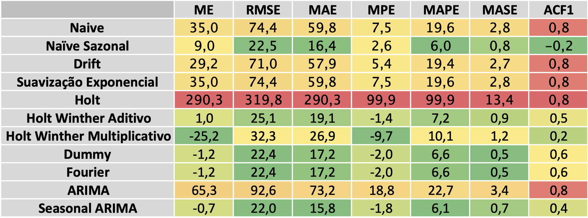
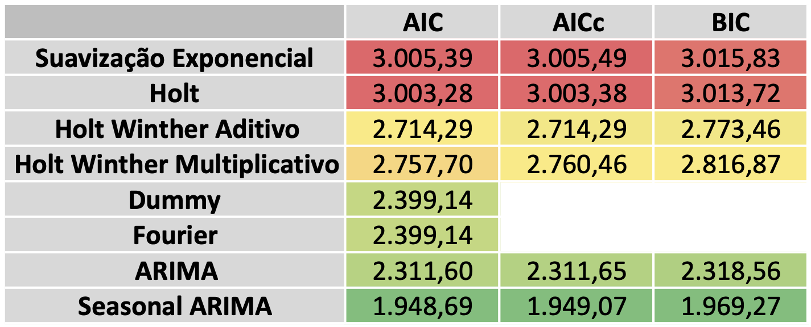

**Nome:** Matheus Amaral Moes  
**Disciplina:**  Análise de Séries Temporais  
**Professor:** Alvaro Villarinho  
**Matrícula:**  
  
```{r, echo = FALSE, warning = FALSE, message = FALSE}
# Opções para geração do PDF
knitr::opts_chunk$set(
  echo = FALSE,
  comment = "",
  fig.width = 7,
  fig.height = 4
  )

# Carregar Bibliotecas
library(readxl)
library(ggplot2)
library(tseries)
library(forecast)
library(seasonal)
library(urca)
```


```{r}
df = read_excel("Fertilizantes.xlsx")
# Converter para timeseries com frequencia mensal
ts.total = ts(df$consumo, frequency = 12, start = c(1998,1))

# Separar em treino e teste
ts.train = window(ts.total,end = c(2017,12))
ts.test = window(ts.total, start = c(2018, 1))
```

## Análise exploratória

O conjunto de dados possui a quantidade de fertilizantes entregues mensalmente em uma série temporal de 1998 a Setembro de 2019. O volume de fertilizantes na série é sazonal com frequência anual, atingindo o pico todos os anos nos mêses de Setembro e Outubro, como é possível notar no gráfico a seguir. É de se notar que a série possui um aumento na amplitude da sazonalidade, indicando uma serie multiplicativa, e uma tendência de aumento no nível ao longo de toda sua duração dois fatos que podem ser melhor observados na decomposição da série posteriormente.

```{r}
autoplot(ts.total) + ggtitle("Fertilizantes Entregues ao mercado")+
  ylab("mil toneladas") + xlab('Ano')
```

## Transofrmações

Realizando transformacoes BoxCox e Logarítimica utilizando a base natural dois resultados são observados. Na transformação Logarítimica a amplitude da serie diminui ao longo do tempo e na transformacao BoxCox a amplitude se manteve estavel ao longo do periodo indicando que a transformação mais adequada para a séria é a BoxCox.

```{r}
lts.total = log(ts.total)
lambda = BoxCox.lambda(ts.total)
boxts.total = BoxCox(ts.total, lambda = lambda)
cbind('Regular' = ts.total, 'Log' = lts.total, 'BoxCox' = boxts.total) %>%
  autoplot(facets = TRUE) + ylab("mil toneladas") + xlab('Ano')
  

```

## Seasonal Plot

Com o Seasonal Plot é possivel ver com maior claridade a sazonalidade da serie e a forma como o pico se concentra entre os meses de Agosto e Outubro e o momento de maior baixa entre os meses de Fevereiro e Abril.

```{r}
ggseasonplot(ts.total, year.labels = TRUE, year.label.left = TRUE)+
  ggtitle("Entrega ao Mercado") +
  ylab("Entrega ao mercado em mil toneladas") + xlab("Mês")

ggseasonplot(ts.total, polar=TRUE) +
  ylab("Entrega ao mercado em mil toneladas") +
  ggtitle("Entrega ao Mercado")

boxplot(ts.total~cycle(ts.total),xlab="meses", ylab = "Mil Toneladas" ,
        col="blue", main ="Boxplot-Entrega de Fertilizantes-BR-1998-2019")
```


## Lag Plot

A visao do Lag Plot da serie corrabora com a visão inicial de que a serie possui uma sazonalidade de 12 meses, uma vez que o valor de lag para 12 meses apresenta os menores valores no lag plot.

```{r}
gglagplot(ts.total)
```

## Auto Correlation Function (AFC) e Partial Auto Correlation Function (PACF)

Observando a função de autocorrelação da série podemos observar que o maior valor de correlação ocorre para um lag de 12 meses, reforcando a visão de que a serie possui uma sazonalidade de 12 meses.

```{r}
# ACF
ggAcf(ts.total)
# PACF
ggPacf(ts.total)
```

## Decomposição

```{r, eval=FALSE, echo = FALSE}
# Decomposicaco classica
ts.total %>% decompose(type="multiplicative") %>%
  autoplot() + xlab("Year") +
  ggtitle("Classical multiplicative decomposition")

# Metodo X11
ts.total %>% seas(x11="") -> fit
autoplot(fit) +
  ggtitle("X11 decomposition")

# Metood X11 ajustada pela sazonalidade
autoplot(ts.total, series="Data") +
  autolayer(trendcycle(fit), series="Trend") +
  autolayer(seasadj(fit), series="Seasonally Adjusted") +
  xlab("Year") + ylab("New orders index") +
  ggtitle("Serie ajustada pela sazonalidade pelo X11") +
  scale_colour_manual(values=c("gray","blue","red"),
             breaks=c("Data","Seasonally Adjusted","Trend"))

# Seasonal Extraction in ARIMA Time Series (SEATS)
ts.total %>% seas() %>%
autoplot() +
  ggtitle("SEATS decomposition of electrical equipment index")

# Seasonal and Trend decomposition using Loess (STL)
ts.total %>%
  stl(t.window=13, s.window="periodic", robust=TRUE) %>%
  autoplot()
```
Após a decomposicao da série em sazonalidade, tendencia e residuos alguns pontos observados anteriormente ficam mais claros. O primeiro deles é o aumento de amplitude na série ao longo do tempo, o segundo é o aumento no nível da série ao longo do tempo, partindo de um patamar inferior a 1.500 e chegando a um patamar de 3.000 ao fim da série.

```{r}
# Metodo X11
ts.total %>% seas(x11="") -> fit
autoplot(fit) +
  ggtitle("X11 decomposition")

# Metood X11 ajustada pela sazonalidade
autoplot(ts.total, series="Data") +
  autolayer(trendcycle(fit), series="Trend") +
  autolayer(seasadj(fit), series="Seasonally Adjusted") +
  xlab("Year") + ylab("New orders index") +
  ggtitle("Serie ajustada pela sazonalidade pelo X11") +
  scale_colour_manual(values=c("gray","blue","red"),
             breaks=c("Data","Seasonally Adjusted","Trend"))
```
## Teste Unitário

Realizando o teste unitário da série temporal 2,6 no teste de hipótese indicando que a série é não estacionária.
```{r}
ts.total %>% ur.kpss() %>% summary()
```
Utilizando o algoritmo fornecido pelo programa R para determinar o número de diferenciações necessárias para atingir a estacionariedade chega-se a conclusão de que é necessária uma diferenciação para atingir a estacionariedade da série. Realizando o teste unitário após uma diferenciação é obtido um p-value de 0,011 indicando que de fato ocorre a estacionariedade após uma diferenciação, essa característica indica que em um modelo ARIMA provavlemnte será necessário um modelo com uma diferenciação.
```{r}
# Numero de diferenciacoes para estacionariedade
print("Diferenciações para estacionariedade:")
ndiffs(ts.total)

ts.total %>% diff() %>% ur.kpss() %>% summary()

```

```{r}
# Converter para timeseries com frequencia mensal
ts.total = ts(df$consumo, frequency = 12, start = c(1998,1))

lambda = BoxCox.lambda(ts.total)
ts.total = BoxCox(ts.total, lambda = lambda)

# Separar em treino e teste
ts.train = window(ts.total,end = c(2017,12))
ts.test = window(ts.total, start = c(2018, 1))
```

## Modelo

Tanto de acordo com as métricas de erro simple como erro médio quadrado (RMSE) e com o critério de Akaike (AICc) o modelo mais adequado foi o modelo ARIMA com sazonalidade e por isso esse foi o modelo adotado. Também tiveram resultados muito positivos os modelos de regressão linear utilizando Dummies e o modelo de regressão utilizando a transformada de Fourier. Outro ponto a ser destacado é a alta correlação observada nos modelos que naão consideram sazonalidade como Suavização Exponencial, Holt e ARIMA não sazonal, indicando que esses modelos não foram capazes de captar adequadamente as variações na série temporal.






```{r}
arima.ts_s <- auto.arima(ts.train)
summary(arima.ts_s)
```

### Previsões

Alta aderência das previsões com baixo erro médio quadrado e pode ser visto visualmente também pela proximidade dos dados projetados e os dados realizados.

```{r}

autoplot(arima.ts_s %>% forecast(h = 21), series = "Previsão") +
autolayer(ts.test, series = "Realizado") + 
xlab("Data") +
ylab("Consumo") +
ggtitle("Fertilizantes") +
guides(colour = guide_legend(title = "Série"))
  

```

### Resíduos

O teste de Portmanteau indica que os resíduos da série não possuem autocorreleação, fato que também é reforçado pelos baixos valores encontrados na função de autocorrelação.

```{r}
checkresiduals(arima.ts_s)
```

## Conclusão 

Os métricas calculadas mostram que o modelo de ARIMA com sazonalida é adequado para realização de previsões na série de tempora utilizada. Além do modelo ARIMA outros modelos também se mostraram adequados para a série em questão, principalmente os modelos de regressão utilizando Dummies e o modelo de regressão utilizando a transformada de Fourier. Foi possível notar também que modelos que não levam a sazonalidade em concideração não foram adequados para modelar o problme dado a sazonalidade da série temporal utilizada.

## Anexo
```{r}
plot_forecast = function(modelo, nome_modelo, train_set, test_set, tslm = FALSE){
  if (tslm){
    modelo = fitted(modelo)
  }
  autoplot(train_set) +
  autolayer(modelo, series = paste("Previsão", nome_modelo)) +
  autolayer(test_set, series = "Realizado") + 
  xlab("Data") +
  ylab("Consumo") +
  ggtitle("Fertilizantes") +
  guides(colour = guide_legend(title = "Série"))
}
```

### Naive

```{r}
fit.naive = naive(ts.train, h = 21)

plot_forecast(fit.naive, 'Naive', ts.train, ts.test)

checkresiduals(fit.naive)

accuracy(fit.naive, ts.test)

summary(fit.naive)
```

### Seasonal Naive

```{r}
fit.seasonal_naive = snaive(ts.train, h = 21)

plot_forecast(fit.seasonal_naive, 'Seasonal Naive', ts.train, ts.test)

checkresiduals(fit.seasonal_naive)

accuracy(fit.seasonal_naive, ts.test)

summary(fit.seasonal_naive)

```

### Drift Method

```{r}
fit.drift = rwf(ts.train, h = 21, drift=TRUE)

plot_forecast(fit.drift, 'Drift Method', ts.train, ts.test)

checkresiduals(fit.drift)

accuracy(fit.drift, ts.test)

summary(fit.drift)

```

### Suavização Exponencial

```{r}
fit.ses = ses(ts.train, h = 21)

plot_forecast(fit.ses, 'Suavização Exponencial', ts.train, ts.test)

checkresiduals(fit.ses)

accuracy(fit.ses, ts.test)

summary(fit.ses)
```

### Holt

```{r}
fit.holt = holt(ts.train, damped = TRUE, phi = 0.9, alpha = 0.97, beta = 0.7, h = 21)

plot_forecast(fit.holt, 'Holt', ts.train, ts.test)

checkresiduals(fit.holt)

accuracy(fit.holt, ts.test)

summary(fit.holt)
```

### Holt Winther Aditivo

```{r}
fit.HWA = hw(ts.train, seasonal = "additive", h = 21)

plot_forecast(fit.HWA, 'HW Aditivo', ts.train, ts.test)

checkresiduals(fit.HWA)

accuracy(fit.HWA, ts.test)

summary(fit.HWA)
```


### Holt Winther Multiplicativo

```{r}
fit.HWM <- hw(ts.train, seasonal = "multiplicative", h = 21)

plot_forecast(fit.HWM, 'HW Multiplicativo', ts.train, ts.test)

checkresiduals(fit.HWM)

accuracy(fit.HWM, ts.test)

summary(fit.HWM)

```

## ETS

```{r}
fit = ets(ts.total)

summary(fit)

autoplot(fit)

cbind('Residuals' = residuals(fit),
      'Forecast errors' = residuals(fit,type='response')) %>%
  autoplot(facet=TRUE) + xlab("Year") + ylab("")

fit %>% forecast(h=21) %>%
  autoplot() +
  ylab("Fertilizantes")
```

### Dummy

```{r}
fit.dummy <- tslm(ts.total ~ trend + season + bizdays(ts.total))

plot_forecast(fit.dummy, 'HW Multiplicativo', ts.train, ts.test, tslm = TRUE)

checkresiduals(fit.dummy)

accuracy(fitted(fit.dummy), ts.test)

summary(fit.dummy)

AIC(fit.dummy)
```

### Fourier

```{r}
fit.fourier <- tslm(ts.total ~ trend + bizdays(ts.total) + fourier(ts.total, K = 6))

plot_forecast(fit.fourier, 'HW Multiplicativo', ts.train, ts.test, tslm = TRUE)

checkresiduals(fit.fourier)

accuracy(fitted(fit.fourier), ts.test)

summary(fit.fourier)

AIC(fit.fourier)
```

### Arima nao sasonal

```{r}
arima.ts_ns <- auto.arima(ts.train, seasonal = FALSE)

prev.Arima <- arima.ts_ns %>% forecast(h = 21)
prev.Arima %>% autoplot()

checkresiduals(arima.ts_ns)

accuracy(forecast(arima.ts_ns), ts.test)

summary(arima.ts_ns)
```

### Arima sasonal

```{r}
arima.ts_s <- auto.arima(ts.train)

prev.Arima <- arima.ts_s %>% forecast(h = 21)
prev.Arima %>% autoplot()

checkresiduals(arima.ts_s)

summary(arima.ts_s)

accuracy(forecast(arima.ts_s), ts.test)
```


```{r}
accuracy_df = rbind(accuracy(fit.naive, ts.test)[2,],
      accuracy(fit.seasonal_naive, ts.test)[2,],
      accuracy(fit.drift, ts.test)[2,],
      accuracy(fit.ses, ts.test)[2,],
      accuracy(fit.holt, ts.test)[2,],
      accuracy(fit.HWA, ts.test)[2,],
      accuracy(fit.HWM, ts.test)[2,],
      accuracy(fitted(fit.dummy), ts.test)[1,],
      accuracy(fitted(fit.fourier), ts.test)[1,],
      accuracy(forecast(arima.ts_ns), ts.test)[2,],
      accuracy(forecast(arima.ts_s), ts.test)[2,]
      )

rownames(accuracy_df) = c('Naive', 'Seasonal Naive', 'Drift', 'SES',
                          'Holt', 'HWA', 'HWM', 'Dummy', 'Fourier',
                          'ARIMA', 'Seasonal ARIMA')

write.csv2(accuracy_df, 'Accuracy')
```


